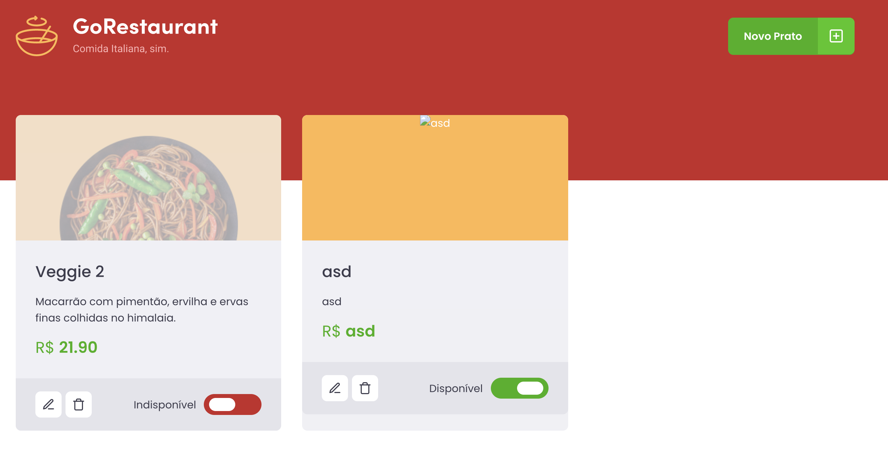

#Desafio Ignite Q3 2021



## Setup

git clone https://github.com/vagnerolliver/ignite-challenge-03-creating-hook-shopping-cart

Instal dependencies 

```bash
$ yarn 

or 

$ npm install
```

## Run


terminal 1

```bash
$ yarn or npm start
````

terminal 2
```
$ yarn server  

or

$ npm start
```

Browser

http://localhost:3000

## Tests
$ yarn or npm test